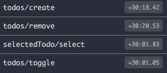

# Comparision

| Redux   |      RTK      |
|----------|:-------------:|
|  |   |
| Must provide the initial state    |    Can't forget in Redux toolkit     |
|Must provide the default case| No default case|
| Use string literals or constants    | Can optionally prepare action    |
| [[Immutably]] update the state | Uses **[[Immer]]** to allow you to write 'mutable' state logic

[//begin]: # "Autogenerated link references for markdown compatibility"
[Immutably]: immutably "Immutably"
[Immer]: immer "Immer"
[//end]: # "Autogenerated link references"