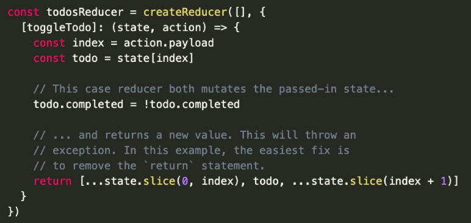
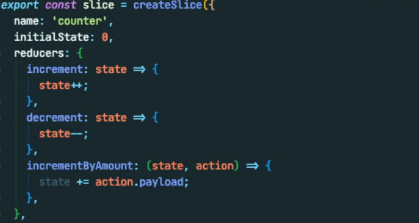

# Immer

### Potential **Pitfalls** of using Immer
1. 'mutating' state directly works BECAUSE of Immer! But we are actually not mutating the state.
    - It is based on [copy-on-write](https://en.wikipedia.org/wiki/Copy-on-write) mechanism.
        
2. "Most importantly, we need to ensure that we either mutate the **state** argument or return a new state, but not both."
  

3. Don't try to apply the 'mutate' logic to a state that is a primitive value!
   

[[Summary]]

[//begin]: # "Autogenerated link references for markdown compatibility"
[Summary]: summary "Summary"
[//end]: # "Autogenerated link references"