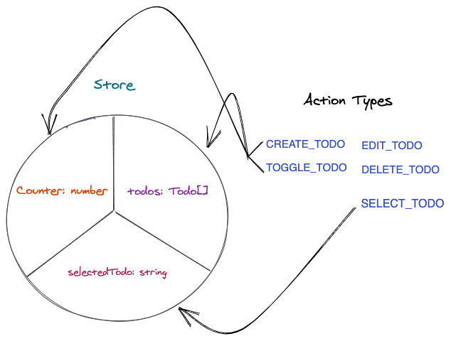

# Redux
#### The old way

[[Steps]]
[[Comparision]]

[//begin]: # "Autogenerated link references for markdown compatibility"
[Steps]: steps "Steps"
[Comparision]: comparision "Comparision"
[//end]: # "Autogenerated link references"